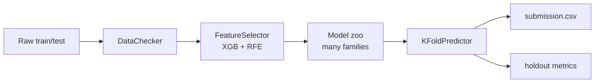

<p align="center">
  
</p>

<h1 align="center">IMBD Helper</h1>

<p align="center">
  <b>Local validation and model diversity for constrained tabular ML competitions.</b>
</p>


IMBD Helper 是一套表格式資料競賽用的小型 pipeline。它適合用在 public score 不可靠、看不到、或不想過度追 leaderboard 的情境：你先建立穩定的 local holdout 與 cross-validation，再用 RFE 和多模型 fold ensemble 降低單一模型偏差。

這個專案特別面向「環境受限」的比賽現場：連線不穩、不能方便使用外部 AutoML/雲端調參、或沒有時間做很深的超參數搜尋時，與其把希望押在單一模型的最佳參數，不如用一批差異夠大的模型 family 互相補位，再用 holdout 表現決定權重。

目前支援：

- 回歸與分類模式：`mode="reg"` / `mode="class"`
- Repeated K-Fold / Repeated Stratified K-Fold
- fold 內獨立的 scaler、Gaussian transform、TargetEncoder
- Ridge、Linear、Lasso、SVR、KNN、RandomForest、XGBoost、LightGBM、CatBoost、MLP、ExtraTrees
- holdout-based weighted ensemble

---

## 核心模組

| 檔案 | 負責內容 |
| --- | --- |
| [Data_checker.py](Data_checker.py) | 資料型別檢查、文字欄位自動編碼、類別/數值欄位管理、holdout + repeated k-fold 切分 |
| [Feature_selector.py](Feature_selector.py) | XGBoost + RFE 特徵選擇，可用整數特徵數量當候選 |
| [Search_hyper_params.py](Search_hyper_params.py) | 可選的 Optuna 超參數搜尋，在連線或時間允許時使用 |
| [train_models.py](train_models.py) | 依 fold 訓練內建樹模型，保留每個 fold-trained model |
| [Kfold_predictor.py](Kfold_predictor.py) | 將 fold 模型套回 holdout / test，依 holdout 表現計算 ensemble 權重 |
| [L1_model_zoo.py](L1_model_zoo.py) | 額外的 L1 模型與殘差相關性檢查工具；Spaceship notebook 也沿用這種大量模型 family 的想法 |

---

## Pipeline



---

## 用法

### 1. 啟動環境

建議使用本專案的 conda 環境：

```powershell
conda activate imbd-helper
```

若環境還沒裝依賴，再執行：

```powershell
python -m pip install -r requirements.txt
```

### 2. 準備資料

以 Spaceship Titanic 為例，資料放在：

```text
demo_datasets/spaceship-titanic/train.csv
demo_datasets/spaceship-titanic/test.csv
demo_datasets/spaceship-titanic/sample_submission.csv
```

若本機已設定 Kaggle CLI，也可以下載：

```powershell
kaggle competitions download -c spaceship-titanic -p demo_datasets/spaceship-titanic
```

### 3. 執行 Notebook

開啟 [spaceship_titanic_imbd_helper.ipynb](spaceship_titanic_imbd_helper.ipynb)，選擇 `imbd-helper` kernel 後依序執行。Notebook 會先做 Spaceship Titanic 專用的欄位整理，再跑完整流程：

```text
DataChecker -> XGB RFE -> 11 model families -> KFoldPredictor
```

Notebook 最上方可以調整這些參數：

| 參數 | 用途 | 建議 |
| --- | --- | --- |
| `N_SPLITS` | 每次 k-fold 的 fold 數 | 正式跑用 `5`，快速測試可降到 `2` 或 `3` |
| `N_REPEATS` | repeated k-fold 重複次數 | 時間夠再提高 |
| `RUN_RFE` | 是否執行 XGB + RFE 特徵選擇 | 正式流程建議 `True` |
| `RFE_CV` | RFE 評估用的 CV fold 數 | 先用 `3`，資料小可提高 |
| `RFE_FEATURE_COUNTS` | 指定 RFE 嘗試的特徵數 | `None` 代表跑 `1..n_features` |

如果只是確認環境和流程，先用：

```python
N_SPLITS = 2
N_REPEATS = 1
RUN_RFE = False
```

確認沒問題後，再切回：

```python
N_SPLITS = 5
N_REPEATS = 1
RUN_RFE = True
```

### 4. 模型組合

Notebook 會跑 11 個 model family 的分類版本：

```text
Ridge, Linear, Lasso, SVR, KNN, RF, XGB, LGBM, CatBoost, MLP, ExtraTrees
```

這裡的設計不是追求單一模型的極限調參，而是在連線受限、不方便使用大型 AutoML 或進階 hyperparameter search 的環境下，用足夠多樣的模型 family 互相補位。最後由 `KFoldPredictor` 根據 holdout accuracy 自動換算 ensemble weights。

### 5. 看結果

產出：

```text
outputs/spaceship-titanic/submission_imbd_helper_all_models_rfe.csv
```

Notebook cell output 裡要看這幾個重點：

- RFE 選到的特徵數與欄位
- 每個 model family 的 CV accuracy
- 每個 model family 的 holdout accuracy
- `KFoldPredictor` 算出的 ensemble weights
- 最終 holdout accuracy

`submission_imbd_helper_all_models_rfe.csv` 符合 Kaggle submission 格式。README 不固定寫 leaderboard 分數，因為這個 repo 的重點是 local validation 流程，而不是事後挑一次最好看的提交結果。

### 6. 換成自己的資料

把自己的資料整理成三個物件：

- `X`：訓練特徵，必須是 `pandas.DataFrame`
- `y`：目標欄位，必須是 `pandas.Series`
- `X_test`：要預測的測試特徵，欄位需與 `X` 對齊

再準備 `typeofFeatures`：

```text
0 = categorical
1 = numerical
```

範例：

```python
import pandas as pd

from Data_checker import DataChecker
from Feature_selector import FeatureSelector

type_of_features = [0 if col in categorical_columns else 1 for col in X.columns]
type_map = dict(zip(X.columns, type_of_features))

checker = DataChecker(
    X=X,
    y=y,
    X_test=X_test,
    mode="class",
    typeofFeatures=type_of_features,
)
checker.varify_data_types()
checker.apply_transformations(use_target_encoder=False)

selector = FeatureSelector(
    X=checker.X,
    y=y,
    mode="class",
    TypesofFeatures=list(range(1, checker.X.shape[1] + 1)),
    cv=3,
)
selector.get_baseline()
selector.get_scores_with_different_thresholds()
X_selected, fitted_selector = selector.get_new_dataset()
X_test_selected = pd.DataFrame(
    fitted_selector.transform(checker.X_test),
    columns=X_selected.columns,
    index=checker.X_test.index,
)
type_of_features_selected = [type_map[col] for col in X_selected.columns]
```

接著用 `X_selected`、`X_test_selected`、`type_of_features_selected` 照 [spaceship_titanic_imbd_helper.ipynb](spaceship_titanic_imbd_helper.ipynb) 的 `train_all_model_zoo` 與 `KFoldPredictor` 區塊訓練模型、算 holdout 權重、輸出 submission。若是回歸問題，把 `mode` 改成 `"reg"`，並使用 `L1_model_zoo.py` 裡的 regressor family。

### 7. 使用時的注意事項

- 先用小設定確認流程，再提高 `N_SPLITS`、`N_REPEATS` 和 RFE 搜尋範圍。
- 如果資料很多，`SVR`、`MLP`、完整 RFE 會比較慢，可以先註解掉做 smoke run。
- 類別欄位要放進 `typeofFeatures` 的 `0`，數值欄位放 `1`。
- 不要用 test label 或 leaderboard feedback 回頭挑特徵；最後判斷以 holdout 和 CV 穩定性為主。

---

## 專案結構

```text
IMBD_helper/
├── Data_checker.py
├── Feature_selector.py
├── Search_hyper_params.py
├── train_models.py
├── Kfold_predictor.py
├── L1_model_zoo.py
├── spaceship_titanic_imbd_helper.ipynb
├── main.py / main_lag1.py / main_z.py / main_lag1_z.py
├── demo_datasets/
├── docs/assets/
└── requirements.txt
```
