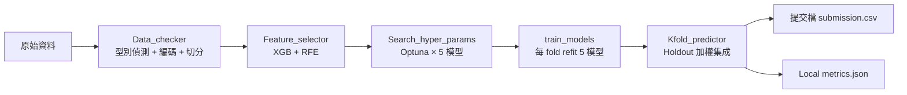

<p align="center">
  
</p>

<h1 align="center">IMBD Helper</h1>

<p align="center">
  <b>Compete smarter when there&rsquo;s no public score.</b><br>
  針對「公開 leaderboard 看不到分數」的競賽情境，打造的表格式機器學習實戰工具箱。
</p>

<p align="center">
  <a href="https://www.facebook.com/THU.thubigdata/?locale=zh_TW"></a>
  <a href="https://www.facebook.com/THU.thubigdata/?locale=zh_TW"></a>
</p>

---

## 關於作者

本專案由 **2025 全國智慧製造大數據分析競賽（IMBD）入圍**、**2024 全國智慧製造大數據分析競賽（IMBD）佳作** 的參賽者所設計與維護。

工具的每一個模組都來自實戰：當比賽的 public leaderboard 被刻意限制、延遲公布、或乾脆不開放分數時，你唯一能倚賴的只有自己建立出來的 local 驗證機制、公平的特徵選擇流程，以及穩定的模型集成策略。IMBD Helper 就是把這些在競賽現場反覆被驗證有效的做法，整理成一套可以直接套用在任意表格資料上的框架。

競賽官方資訊與歷屆紀錄可參考： [東海大學巨量資料分析與智慧應用粉絲專頁](https://www.facebook.com/THU.thubigdata/?locale=zh_TW)。

---

## 解決什麼問題

在 IMBD 等競賽裡，「能不能上 leaderboard」往往不是瓶頸，**「本地驗證的分數跟最終 private score 對不對齊」** 才是。當 public score 被延遲或根本看不到時，你需要：

1. **可信的 local holdout** — 一份從頭到尾沒被任何模型看過的資料。
2. **嚴謹的 cross-validation** — Repeated Stratified K-Fold，避免單次切分的運氣成分。
3. **公平的特徵選擇** — 不使用會洩漏 target 的方法，每個 fold 都是獨立 refit。
4. **不同家族的模型集成** — 避免單一演算法偏差主宰結果。
5. **以 holdout 表現為權重的加權平均** — 而不是盲目平均各模型輸出。

IMBD Helper 把這五件事包裝成五個可以獨立使用、也可以串成 pipeline 的模組。

---

## 核心特色

| 模組 | 功能 | 技術重點 |
| --- | --- | --- |
| **[Data_checker.py](Data_checker.py)** | 資料檢查與預處理 | 自動偵測類別/數值欄位、OrdinalEncoder 合併 train+test 以避免 unseen categories、RobustScaler + QuantileTransformer 穩健化、分層交叉驗證切分與 fold diversity 檢驗 |
| **[Feature_selector.py](Feature_selector.py)** | 特徵選擇 | XGBoost + RFE 遞迴式特徵消去，支援 GPU 加速，比較不同特徵數量下的 CV 分數以選出最佳子集 |
| **[Search_hyper_params.py](Search_hyper_params.py)** | 超參數搜尋 | 使用 Optuna 對 XGBoost / RandomForest / ExtraTrees / LightGBM / CatBoost 分別做獨立搜尋，支援 GPU 與分類/回歸模式 |
| **[train_models.py](train_models.py)** | 模型訓練 | 在每個 fold 重新訓練 5 家不同模型，保留所有 fold-trained 模型與對應的預處理物件 |
| **[Kfold_predictor.py](Kfold_predictor.py)** | 加權集成預測 | 以 holdout 表現作為權重計算各模型貢獻度，對 test set 做加權機率平均，產生最終提交檔 |

### 為什麼這樣設計

- **預處理物件跟著 fold 走**：每個 fold 有自己的 scaler、transformer、encoder，確保驗證時不會用到當前 fold 看不到的統計量。
- **Classification 用機率平均、不是多數決**：保留模型的不確定性資訊，讓 ensemble 更穩。
- **Holdout 永遠獨立**：holdout 在第一階段切出來之後，不參與任何 CV、不參與任何特徵選擇、不參與任何超參數搜尋，只在最後一步用來計算集成權重。

---

## 工作流程



---

## 技術堆疊

- **模型**：XGBoost、LightGBM、CatBoost、RandomForest、ExtraTrees
- **搜尋**：Optuna（TPE sampler，支援 GPU）
- **驗證**：`RepeatedStratifiedKFold` / `RepeatedKFold`
- **前處理**：`RobustScaler`、`QuantileTransformer`、`OrdinalEncoder`、（可選）`TargetEncoder`
- **視覺化**：matplotlib、seaborn
- 完整依賴請見 [requirements.txt](requirements.txt)

---

## Benchmark：Spaceship Titanic

專案內建 [benchmark_spaceship.py](benchmark_spaceship.py)，在 Kaggle 的 Spaceship Titanic 資料集上比較：

- **Baseline**：使用預設參數的單一 XGBoost。
- **Custom ensemble**：走完整 IMBD Helper pipeline（特徵工程 → 特徵選擇 → 超參數搜尋 → 5 模型訓練 → holdout 加權集成）。

### 安裝

```powershell
python -m pip install -r requirements.txt
```

### 資料放置

將 Kaggle 官方檔案放到：

```text
demo_datasets/spaceship-titanic/train.csv
demo_datasets/spaceship-titanic/test.csv
demo_datasets/spaceship-titanic/sample_submission.csv
```

或使用 Kaggle CLI：

```powershell
kaggle competitions download -c spaceship-titanic -p demo_datasets/spaceship-titanic
```

### 執行

```powershell
python benchmark_spaceship.py
```

快速 smoke run（跳過 Optuna 搜尋）：

```powershell
python benchmark_spaceship.py --optuna-trials 0 --n-splits 3 --feature-cv 3
```

### 產出

```text
outputs/spaceship-titanic/submission_default_xgb.csv
outputs/spaceship-titanic/submission_custom_ensemble.csv
outputs/spaceship-titanic/metrics.json
```

兩份提交檔皆符合 Kaggle 要求的 `PassengerId,Transported` 格式。

---

## 典型使用情境

- **公司內部 POC 建模**：只有一份歷史資料、沒有公開對照分數，需要自己建立可信的驗證流程。
- **封閉型競賽**：IMBD 這類複賽/決賽才公布最終分數的比賽，前期只能依靠 local CV + holdout 判斷改動是否真的有效。


---

## 專案結構

```text
IMBD_helper/
├── Data_checker.py         # 資料檢查、編碼、切分
├── Feature_selector.py     # XGB + RFE 特徵選擇
├── Search_hyper_params.py  # Optuna 超參數搜尋
├── train_models.py         # 5 模型 fold 訓練
├── Kfold_predictor.py      # Holdout 加權集成
├── L1_model_zoo.py         # 額外 L1 模型池（stacking 用）
├── compare_preprocess.py   # 前處理方案比較
├── benchmark_spaceship.py  # Kaggle Spaceship Titanic 範例
├── main.py / main_lag1.py / main_z.py / main_lag1_z.py
├── requirements.txt
└── docs/assets/            # hero 圖與其他素材
```

---

## 聯絡

若對專案有建議、想交流競賽策略，歡迎循以下管道聯絡：


- Issue / PR：直接在本 repo 提出


